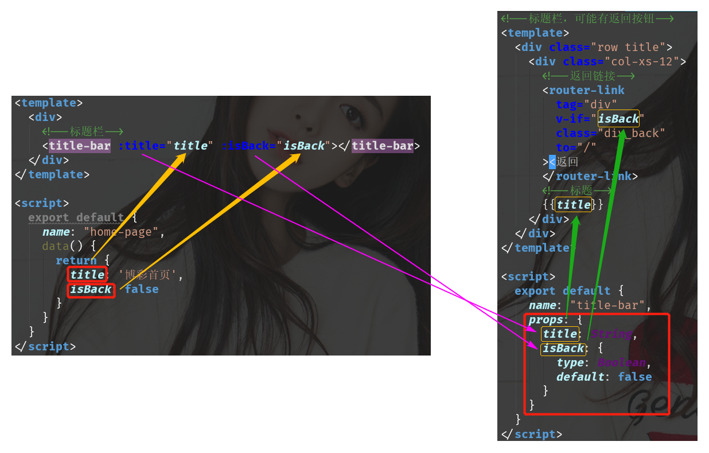

# lottery-vue

> A Vue.js project of lottery

## 项目环境准备

### 1.项目目录结构

- build：构建相关目录
- config：开发相关配置
- src：要编写的代码
  - pages : 所有的页面组件放在这里
    - common: 页面所有的公用组件
  - utils : 放置工具类
  - store : 放置vuex数据仓库
- static：不需要webpack处理的静态文件，比如压缩后的资源,可以直接访问

### 2.安装JQuery和Bootstrap

> 安装JQuery

由于bootstrap依赖Jquery,所以需要先安装jquery,这里版本使用1.11.3

```shell
npm install jquery@1.11.3 --save
```

找到build/webpack.base.conf.js文件,在文件头部添加引用

```shell
const webpack = require('webpack');
```

在文件所有配置对象的末尾增加如下配置

```shell
plugins: [
    new webpack.ProvidePlugin({
        $: "jquery",
        jQuery: "jquery",
        "windows.jQuery": "jquery"
    })
]
```

> 安装Bootstrap

```shell
 npm install bootstrap@3.3.7 --save
```

引入bootstrap,在**src/main.js**文件的顶部加入bootstrap的主要文件引用

```js
import 'bootstrap/dist/css/bootstrap.min.css'
import 'bootstrap/dist/js/bootstrap.min.js'
```

### 3.vue-devtool准备

vue-devtool是Vue官方提供的开发调试工具，能帮助我们查看Vue组件的数据，状态等属性。

链接地址:https://github.com/vuejs/vue-devtools

## 项目总结

vue的核心概念包括**数据驱动**和**组件化**，所有的操作都是围绕这两个核心点来进行的。

#### 前端的数据，来自两个部分：

- 通过axios从后台获取

```js
import axios from 'axios'

mounted() {
    axios.get('/api/detail?code=' + this.code).then(res => {
        this.history = res.data.data
    })
}
```

- 从本地内存中获取

#### 组件之间数据传递的方式分为两种：

- 父子组件之间进行通信

  - 父传子

    - 通过子组件在实例中声明props，来接收父组件传递的信息

    

    

  - 子传父

    - 通过$emit触发事件来通知父组件修改数据

    

- 非父子组件通过vuex来通信

> 本质上就是在内存中开辟一块共享空间，在此空间存储所有组件的状态，并以相应的规则保证状态以一种可预测的方式发生变化，即通过mutations来真正的修改数据。

##### 如何操控这个内存空间，如何获取，如何修改呢？

一般套路来讲，建立store文件夹，结构如下:

- store

  - index，管理所有的store文件

  ```js
  import Vue from 'vue';
  import Vuex from 'vuex'
  import user from './user.js'
  import cart from './cart.js'
  // 如果在模块化构建系统中，请确保在开头调用了 Vue.use(Vuex)
  Vue.use(Vuex)
  
  export default new Vuex.Store({
    modules:{
      user,
      cart
    }
  });
  ```

  - cart，根据需求自定义的仓库

然后在main.js中引入store，main.js管理所有公用的文件

```js
import store from './store'
```

##### 如何编写store文件？

> 以cart.js为例

```js
//1.定义保存数据的地方
const state={
  
}
//2.对外提供访问数据的方法,相当与javabean中的getter
const getters={
  
}

//3.对外提供获取数据的方法，相当于javabean中的setter
const actions={
  addToCart(context,data){
    context.commit('mAddToCart',cartItem);
  }
}

//4.跟踪数据变化的,vue需要的, 真正修改数据
const mutations = {
  mAddToCart(state,cartItem){
    state.carts.push(cartItem);
    //将内存中的数据保存到浏览器本地
    localStorage.setItem("carts",JSON.stringify(state.carts))
  }
}

//5.导出文件的所有内容
export default {
  state,getters,actions,mutations
}
```

##### 如何使用store中的数据呢?

```js
//在需要使用的地方,引入辅助函数mapGetters、mapActions
import {mapActions,mapGetters} from 'vuex'

//通过扩展运算符来引用store中的方法或者属性
//这样就可以将共享空间中的属性或者方法,注入到此处作为局部变量或者局部方法
methods:{
    ...mapActions(['addToCart'])
}
          
computed:{
    ...mapGetters(['cartSize'])
}
```

#### 组件之间的跳转

创建router文件夹，创建index.js文件，管理所有的组件路由

```js
import Vue from 'vue'
import Router from 'vue-router'
import HomePage from '@/pages/home/HomePage'

Vue.use(Router)

export default new Router({
	routes: [
        {
            path: '/',
            name: 'HomePage',
            component: HomePage
        }
    ]
})
```

在main.js中引入router

```js
import router from './router'
```

##### 如何使用路由跳转？

```js
//不带参数
this.$router.push('/user');

//带参数
this.$router.push({
    name: 'LotteryDetail',//通过路由名跳转
    params: {
    code: historycode
})
```
